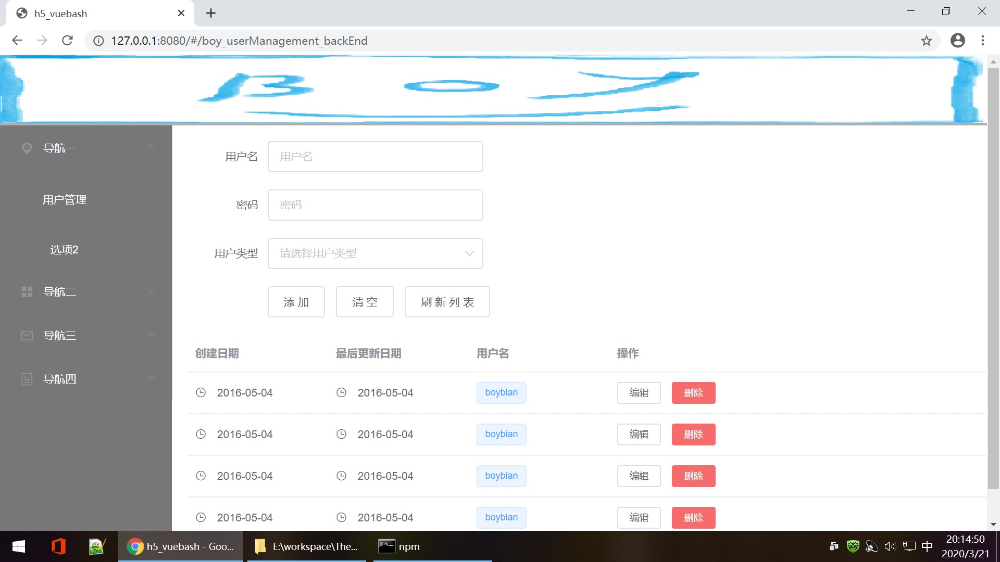
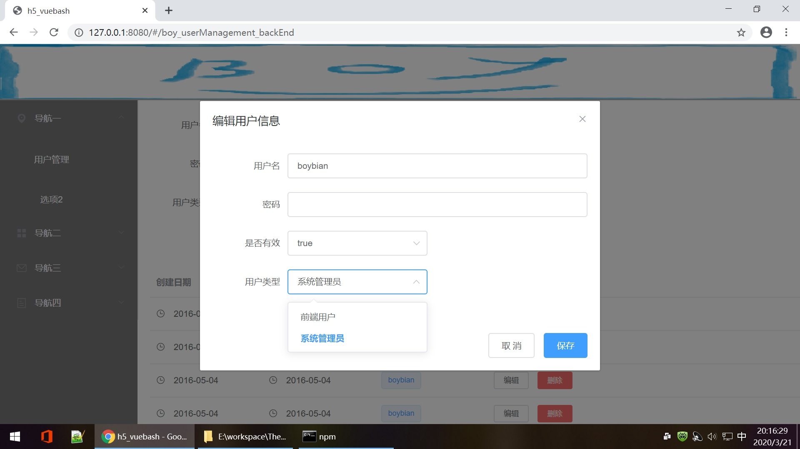

# viewNodes_H5
Some H5 UI framework which was created by JavaScript and support PC/Mobile devices to be integrated to boyplatform board section backend. 
Currently Support JS framework: Vue.

## Normal Pages

- Add,select,delete view
  
  
  
- Edit view

  
